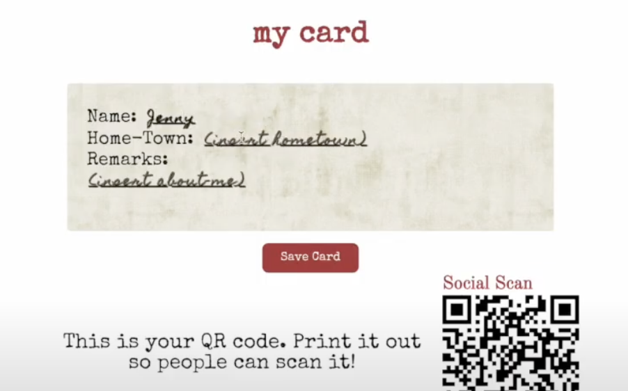
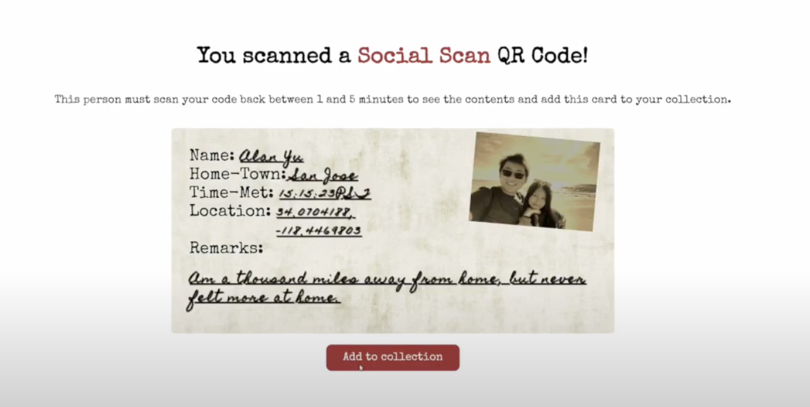
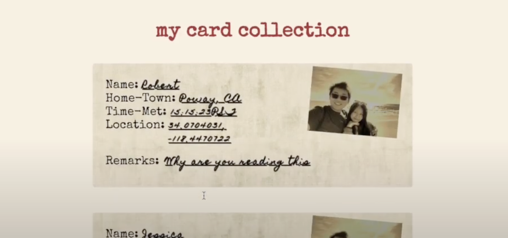
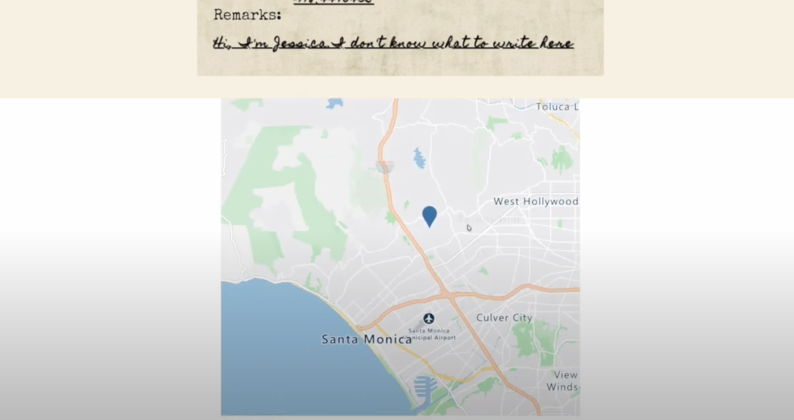

# Social Scan - LA Hacks 2023
⭐  Best Use of Microsoft Cloud For Your Community

## 🌱  Inspiration
Meeting new people can be challenging, especially when it's hard to even approach people in the first place. Additionally travelers on the go, especially solo travelers, might want to meet new people and form new connections, so what better to do that than to approach random strangers?

## 👥 What it does

Social Scan is based off of QSL cards, which, during the early days of radio broadcasting, are written confirmations of communication between two radio stations. Social Scan focuses on forming connections with strangers or just people you aren’t as familiar with through in-person conversations.

 To use it, you can log in to the app, where you can customize your own QSL card that will be shown to other people. You’ll also get your own QR code that you can print out and put on things like your keychains as an invitation for other people using the app to talk to you and scan your code.

When you find someone in the wild with a Social Scan QR code, you can scan it, but to view their QSL card and add it to your collection, they need to scan your card within 1-5 minutes of you doing it. This is to ensure that there is a mutual connection going on and the 1 minute minimum time frame is to force you and that person to either talk to each other a little or (awkwardly stand there).

In your profile page, you can view your card collection of all of the people you’ve met, as well as the location where you met them on a map so you can visualize your interactions, especially if you like to travel.

Overall, Social Scan aims to make forming spontaneous connections into a fun game and we hope that it’ll encourage people to break out of their comfort zone.

## 🛠️ How we built it
We made Social Scan with React for the frontend, Firebase to store data and authorize users, and Microsoft Azure Maps for making and displaying the map.

## 🧑‍💻 Challenges we ran into
As hackathon participants, we've had our fair share of struggles with Git. Although Git is a powerful version control system, it can be challenging to use, especially when it comes to merging and rebasing.

One of the most common challenges we faced with Git was merging code. Whenever we tried to merge two branches, conflicts would arise, and we would have to manually resolve them. It was time-consuming and often frustrating, especially when we had to deal with a large codebase. Moreover, if the conflict wasn't resolved correctly, it could lead to code errors and bugs.

Another Git challenge we encountered was with rebasing. Rebasing involves taking changes from one branch and applying them to another. This process can be tricky, and if not done correctly, it can cause significant problems. For instance, if we rebased a branch that was already merged into another branch, it could create duplicate commits and make the Git history more confusing.

## 🏆 Accomplishments that we're proud of
We are extremely proud of ourselves for finishing the project despite the challenges we faced, including two members dropping out of it midway. Despite the setbacks, we worked hard and persevered, and we are thrilled to have completed the project successfully.

Although our project is not fully polished, we are still very happy with what we created. We were able to implement the core features that we set out to build, and we overcame many obstacles along the way. We are proud of the effort we put in, and we believe that our project has great potential for future development.

Most importantly, we learned a lot from this experience. We learned about teamwork, communication, and problem-solving. We discovered our strengths and weaknesses, and we grew as developers. We are excited to take what we learned and apply it to future projects.

## 📕 What we learned
As a team, we learned a lot from this project, including how to work with various technologies such as Git, Azure Maps, and React.

Firstly, we learned about the importance of Git as a version control system. We had to learn how to use Git effectively, including merging, rebasing, and resolving conflicts. We also learned about Git tools such as GitKraken and SourceTree, which helped us visualize and understand the Git process better. By using Git, we were able to work together more efficiently, track changes to our code, and avoid making mistakes that could have been costly.

Secondly, we learned about Azure Maps, a powerful mapping platform from Microsoft. We had to learn how to use the Azure Maps API to integrate maps into our application. We learned about creating maps, markers, and popups, as well as how to customize the appearance of the map. We also learned about the different types of Azure Maps data, including vector tiles and traffic data, and how to use them to enhance our maps.

Thirdly, we learned about React, a popular JavaScript library for building user interfaces. We had to learn how to use React to build components, manage state, and handle events. We learned about the different React lifecycle methods and how to use them effectively. We also learned about React Router, a tool for managing navigation in a React application.

## 📲What's next for Social Scan
Right now, Social Scan is a web application, so we want to make Social Scan into a mobile app so it would be more convenient for users since they would probably be scanning the QR codes on their phones. We also want to add features that displays statistics about the people that users are connecting with.